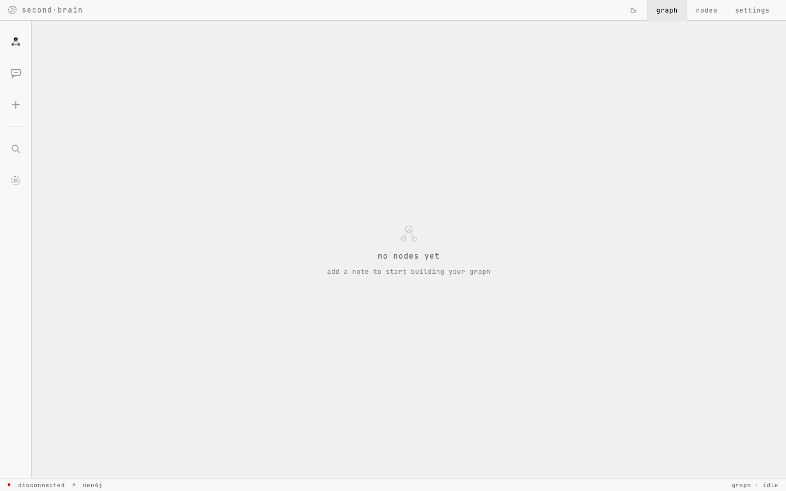
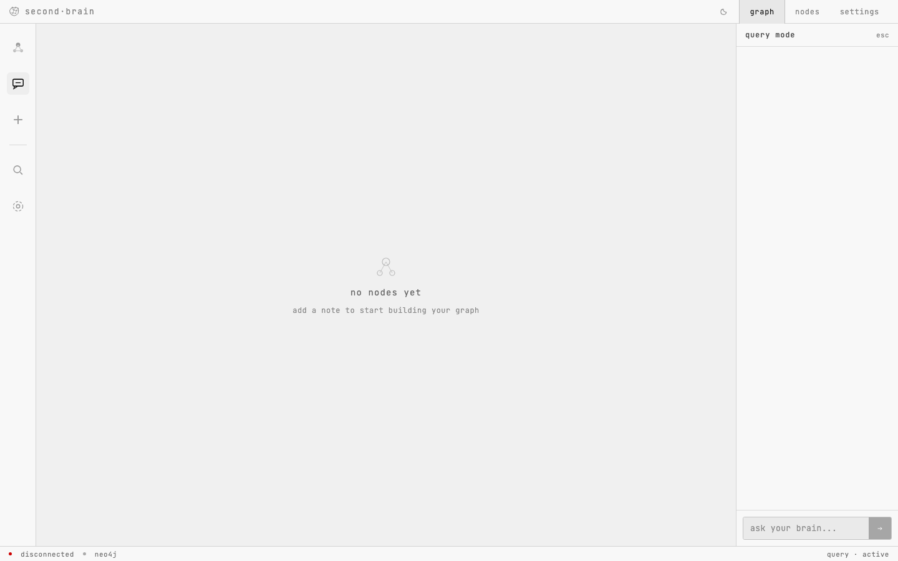
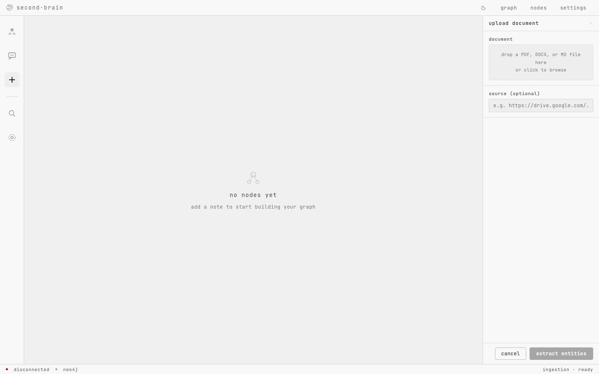

# Second Brain — Knowledge Graph AI

A company document intelligence tool. Ingest PDFs, DOCX files, and Markdown notes, and watch them become an interactive 3D knowledge graph. Ask natural-language questions and get grounded answers with graph-highlighted sources.

---

## Screenshots

| Graph view | Chat / Query | Upload document |
|:---:|:---:|:---:|
|  |  |  |

---

## What it does

1. **Ingest** — upload a document; GPT-4o-mini extracts entities and relationships from the text.
2. **Store** — nodes and edges are written to Neo4j. Each concept embeds a 384-dim vector via a local HuggingFace model (no API cost).
3. **Query** — ask a question; the backend runs Graph-RAG (vector search + graph traversal) and returns an answer with the source node IDs.
4. **Visualise** — a 3D force-graph renders the full knowledge graph; answered nodes light up white.
5. **MCP** — three tools (`search_nodes`, `get_neighbors`, `find_path`) are exposed as an MCP server so Claude Desktop can query the graph directly.

---

## Tech stack

| Layer | Technology |
|---|---|
| Backend | Python · FastAPI · Uvicorn |
| Database | Neo4j AuraDB (graph + vector index) |
| Embeddings | `sentence-transformers/all-MiniLM-L6-v2` (local, 384 dims) |
| LLM | OpenAI `gpt-4o-mini` |
| Frontend | React · `react-force-graph-3d` · Vite |
| Deployment | Railway (backend) · Vercel (frontend) · Neo4j AuraDB (prod DB) |

---

## Project structure

```
second-brain/
├── backend/
│   ├── main.py               # FastAPI app entry point
│   ├── config.py             # pydantic-settings env var loader
│   ├── routers/
│   │   ├── ingest.py         # POST /ingest
│   │   ├── query.py          # POST /query
│   │   └── graph_router.py   # GET /graph, DELETE /graph
│   ├── services/
│   │   ├── embedder.py       # HuggingFace sentence transformer
│   │   ├── extractor.py      # file parsing + GPT-4o-mini extraction
│   │   ├── graph.py          # all Neo4j read/write operations
│   │   └── rag.py            # Graph-RAG query pipeline
│   ├── requirements.txt
│   └── .env.example
├── frontend/
│   ├── src/
│   │   ├── App.jsx
│   │   ├── api.js            # all fetch calls (single source of truth)
│   │   └── components/
│   │       ├── GraphCanvas.jsx
│   │       ├── ChatPanel.jsx
│   │       ├── AddNote.jsx
│   │       ├── NodeDetail.jsx
│   │       └── SettingsPanel.jsx
│   └── package.json
├── glossary/                 # learning reference for the tech stack
└── test files/               # sample documents for manual testing
```

---

## Local setup

### Prerequisites

- Python 3.11+
- Node.js 18+
- A Neo4j AuraDB instance (free tier works) — or run Neo4j locally via Docker
- An OpenAI API key

### 1. Clone and configure

```bash
git clone https://github.com/jashdoshi/Second-Brain.git
cd Second-Brain
```

Copy the env example and fill in your credentials:

```bash
cp backend/.env.example backend/.env
```

```
OPENAI_API_KEY=sk-...
NEO4J_URI=neo4j+s://xxxxxxxx.databases.neo4j.io
NEO4J_USERNAME=neo4j
NEO4J_PASSWORD=your-password
```

### 2. Start the backend

```bash
cd backend
pip install -r requirements.txt
uvicorn main:app --reload
```

Backend runs at `http://localhost:8000`  
Interactive API docs at `http://localhost:8000/docs`

### 3. Start the frontend

```bash
cd frontend
npm install
npm run dev
```

Frontend runs at `http://localhost:5173`

---

## API endpoints

| Method | Path | Description |
|---|---|---|
| `POST` | `/ingest` | Upload a file; set `commit=false` for preview, `commit=true` to write |
| `POST` | `/query` | Ask a question; returns answer + source node IDs |
| `GET` | `/graph` | Fetch all nodes and edges for the frontend |
| `DELETE` | `/graph` | Clear the entire graph |

---

## Environment variables

| Variable | Description |
|---|---|
| `OPENAI_API_KEY` | OpenAI API key — used for entity extraction and Q&A |
| `NEO4J_URI` | AuraDB connection URI (`neo4j+s://...`) |
| `NEO4J_USERNAME` | Neo4j username (default: `neo4j`) |
| `NEO4J_PASSWORD` | Neo4j password |

All secrets live in `backend/.env` (gitignored). Never hardcode them.

---

## Build phases

| Phase | Status | Description |
|---|---|---|
| 1 | Done | Environment setup — all services running |
| 2 | Done | Ingestion pipeline — `/ingest` writes nodes to Neo4j |
| 3 | Done | Graph-RAG query engine — `/query` returns grounded answers |
| 4 | In progress | MCP server — tools callable from Claude Desktop |
| 5 | In progress | 3D frontend — graph renders, chat works, nodes highlight |
| 6 | Upcoming | Deploy — Railway + Vercel + AuraDB |
